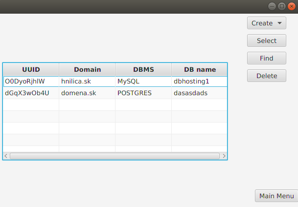
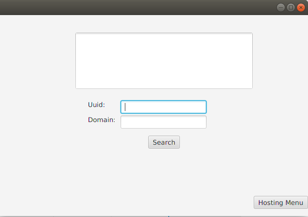
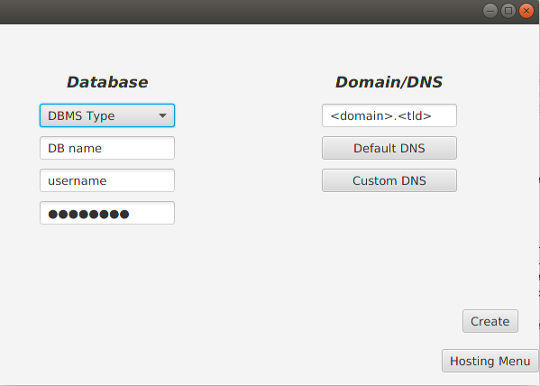

### Jakub Hnilica
#### WebHosting

#### Zámer projektu
Hosting poskytuje klientom najmä IaaS (infrastructure as a service). Interagovať budú hlavne užívateľ, produkt a administračné rozhranie, medzi ktorými budú určité vzťahy. Budú rôze druhy zákazníkov (VIP, sponzorovany, klasicky).

 K dispozícii budú taktiež rôzne druhy produktov (dedikovaný server, VDC, VPS,  hosting, biznis hosting).  Vzťahy, kompozície atp. medzi produktami môzme znázorniť napríklad nasledovne. Hosting má jedno uuid (identifikátor), jednu až niekoľko domén, vela virtualhostov.  Každá doména môže mať viac virtualhostov,  každý virtualhost má jednu PHP verziu.  Hosting má k dispozícii x súbežne bežiacich procesov, biznis hosting xy.

 Administračné rozhranie bude rozoznávať minimálne dva druhy uživateľov (zamestnanec, zákazník). Cez rozhranie bude možné registrovať nových užívatelov, resetovať heslá. Taktiež poskytne základný toolkit zamestnancom. Zamestnanec bude vedieť meniť, aktivovať/deaktivovať služby a produkty všetkých zákazníkov, zasielať hromadné maily. Bude napríklad schopný zablokovať zasielanie PHP mailov pre danú doménu (SPAM).

Zákazník bude vedieť objednávať a spravovať produkty pod svojim účtom(napríklad meniť parametre).  Bude môcť vytvárať mailové schránky, FTP účty a databázy. VIP zákazník bude vedieť vytvoriť ticket v ticketovacom systéme a vyžiadať si takto extra zásah v rámci svojho servera. Pridelený riešitel bude meniť stav ticketu, na konci odráta čas, ktorý bol potrebný na riešenie z predplateného. Prihlasovanie a zásadné zmeny sa budú overovať 2-faktorov autentifikáciou.

#### Krátky popis GUI

Z úvodnej obrazovky ("*Main Menu*") sú aktuálne funkčné prvé dve možnosti ("**Hosting**", "**Server**").



Ako vidno na *obrazok1*, na "*Hosting Menu*" obrazovke máme tabuľku s prehľadom existujúcich hostingov. Taktiež máme k dispožícii niekoľko tlačidiel s rôznou funkcionalitou (funkcionalita tlačidla "**Select**" ešte nie je implementovaná, ani v prípade *Server Menu*). Po označení záznamu v tabuľke kliknutím myši je možné záznam zmazať ("**Delete**"). Nezmaže sa len z tabuľky, zmaže sa taktiež jeho referencia z Hash Mapy (ďalej databáza), v ktorej sú tieto referencie uchovávané. Čo sa týka samotného označenia, rozhodol som sa ponechať defaultnú hodnotu. To znamená, že v prípade potreby zmazania viacerých záznamov bude tieto treba jednotlivo vyklikať. Je to tak riešené z dôvodu, aby sa zmenšilo riziko, že dôjde k zmazaniu nesprávneho záznamu. Po kliknutí na "**Find**" sa otvorí obrazovka vyhľadávania Hostingov.



Implementované je zatiaľ len vyhľadávanie pomocou uid, vyhľadávanie pomocou domény bude doimplementované neskôr.
Identifikátor je potrebné zadať do poľa (*Uuid*) a stlačiť "*Search*". Neskôr bude doimplementovaná aj úprava vyhľadaných hostingov, z vyhľadávania bude možné otvoriť administráciu daného Hostingu. Button **Hosting Menu** opäť vykreslí *Hosting Menu*. Po kliknutí na **Create**->**Wordpress** sa otvorí obrazovka *Create wordpress hosting* (niekedy je nutné kliknúť 2 krát, kvôli *Menu Button*). 



Po vyplnení polí a kliknutí na Button **Create** sa vd db vytvorí daný Hosting (odporúčam vyplniť všetky polia, výnimky sa neošetrovali úplne). Po kliknutí na **Hosting Menu** ho uvidíme aj v tabuľke. Po vrátení so do *Main menu* (button **Main Menu**) môžme obdobné operácie vykonávať aj v *Server* sekcii. *Database menu* nie je implementované.

V programe je zreteľné oddelenie aplikačnej logiky od používateľského rozhrania. Toto je realizované najmä prostredníctvom **MVC**. Pre uchovanie dát a prácu nad nimi slúži vrstva *Model* (jej triedy sa nachádzajú prakticky všade okrem balíkov **views** a **controllers**). *View* slúži na vykreslenie *GUI*. Controller ďalej na interakciu medzi modelom a view. Čo sa týka dedenia (viac úrovňového), toto môžme vidieť pri dedení *Serverov* a *Hostingov* z *abstraktnej* triedy **Product**. Ďalej tu máme dedenie v prípade Databáz, či užívateľov. Čo sa týka agregácie, je veľa príkladov, ktoré môžme nájsť ako pri Hostingoch, tak aj pri Serveroch, či databázach, stačí si pozrieť triedy. Niekedy sa jedná aj o mnoho násobnú kompozíciu. Polymorfizmus je realizovaná prostredníctovm rozhrania Addable, ako aj prekonávania a preťažovania, či implementovania mnohých metód (či už abstraktných metód (```init()```), metód abstraktných tried (metódy triedy *Server*) alebo metód tried, z ktorých je dedené.) 

### Plnenie kritérií hodnotenia

#### 1.)
        Mám za to, že program je plne funkčný, spĺňa zámer projektu. Nedostatky objavené počas prezentácie na cvičení boli doimplementované. Dovolím si tvrdiť, že nad rámec požiadaviek.
#### 2.) 
        Zdrojový kód, v prípade, že bude spúšťaný v Eclipse a obsahuje AspectJ bude plne funčný a obsahovať všetky protrebné súčasti. Bude nutné zmeniť cesty k .ser súborom tak, aby zodpovedali štruktúram priečinkov na PC a operačnom systéme cvičiaceho.
#### 3.) a 4.)
         Tieto boli splnené už v poslednom bode odovzdania
#### 5.)
        Všetky triedy a metódy, rpi ktorých som mal podozrenie, že by mohli byť horšie čitateľné alebo su veľmi dôležité pre pochopenie fungovania programu su riadne okomentované
        
### Ďalšie kritériá

#### 1.) návrhové vzory
       Vo svojom projekte mám, okrem niekoľkých prípadov Singleton, 3 návrhové vzory a to Observer, Visitor a Strategy. Rozhrania potrebné pre Visitor sú navýše vhniezdené v triede products.servers.NestedVisitors, čím je splnená časť ďalšieho kritéria. Implementáciu Strategy design patternu nájdeme v balíku paymethods, context k nemu potom v balíku products v triede Product. Diagramy daných tried je možné nájsť medzi obrázkami.
       
#### 2.) vlastné výnimky
       Vo svojom projekte mám niekoľko vlastných výnimiek. Za všetky by som zmienil výnimku products.databases.UsedUuidException, ktorá slúži na odchytenie stavu, kedy sa pokúšame do DB pridať objekt s už použitým identifikátorom. Fungovanie je podrobne okomentované v triede products.databases.Database v metóde generateUuid() a v triede samotnej výnimky.
       
#### 3.) Poskytnutie GUI
 
       Táto podmienka bola z mojej strany splnená už v predchádzajúcom odovzdaní. User interface sa podarilo oddeliť od aplikačnej logiky, manuálne handlers je možné nájsť v balíku controllers.

#### 4.) RTTIs

       RTTI je použité v triede products.Product na rozoznanie druhov platieb.

#### 5.) Vhniezdené triedy/rozhrania

       V projekte som využil vhniezdené triedy, ako aj vhniezdené rozhrania a to konkrétne:
    - rozhrania používané na uplatnenie Visitor design pattern sú vhniezdené v triede products.servers.NestedVisitor a taktiež mám vhniezdené triedy, ktoré sú v kompozícii v rámci serverov patria logicky do kopy (RAM, OS, STORAGE) v rámci triedy products.components.ServerComponents
    
#### 6.) Lambda

       Lambdu som vo svojom projekte použil najmä pri metóde generateRandomString() v triede products.databases.Database.
      
#### 7.) ASPECTJ
       AspectJ som použil na validáciu vstupu od užívateľa pri vztváraní nových produktov (VPS, WPHosting). Funguje to tak, že v prípade, že uživateľ nevyplní korektne všetky povinné polia, vybehne allert, ktorý ho nepustí alej, pokiaľ nezjedná nápravu. Taktiež Aspectom ošetrujem napríklad nepovinné pole *domain* pri WPHostingu, ktoré ak zákazník nevyplní, nenahrá sa do DB v tvare *<domena>.<tld>*, ale ako prázdny string.
 
 #### 8.) Serializácia
       Serializáciu vzužívam na ukladanie databáz s produktami. K serializácii dôjde pred korektným ukončeném behu programu (zavretie okna krížikom). V prípade, že sa program neukončí korektne, k serializácii nemusí dôjsť! K deserializácii prichádza pri spustení nového okna. *Je nutné nastaviť si vlastnú cestu k .ser súborom v prípade, že si to chcete otestovat!*
       
       

### Ostatné kritériá
Ostatné kritériá sa mi žiaľ vzužiť nepodarilo.
Súčasťou správy majú byť štruktúra systému vo forme diagramov. Tieto sa nachádzaju v oop-2020-str-16-a-lang-xhnilic3/oop_fotky. Ich príslušnosť miestu kódu je možné identifkovať podla názvu. Nachádza sa medzi nimi aj diagram, ktorý popisuje, ako som skombinoval vzory visitor a observer. Podľa týchto vzťahov je možné porozumieť kódua prípadne v ňom nájsť podrobnejšie informácie. Javadoc je možné vygenerovať z docstringov v projekte. Neprikladal som ju na Github, bolo nám povedané, že prikladať súbory, ktoré je možné generovať nie je dobrá prax.
   


